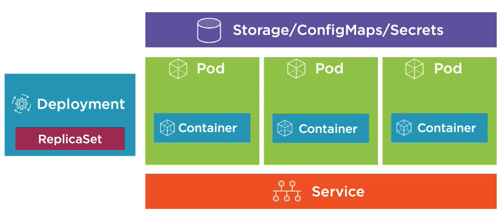

# Kubernetes
 

# Introduction
Deploy WeightTracker App using Azure Kubernetes Cluster,
Plus deployment with helm option.

 


# Project Overview
First of all we will create a Kubernetes Cluster in Microsoft’s Azure Kubernetes Service (AKS) for the project infrastructure.

 

Once the cluster is created we are going to run our NodeWeightTracker application on top of AKS.
This means that we need to write all the configuration files that are needed for running our application in a Kubernetes Cluster.

 

Finally we will, update or CI/CD process to deploy our already dockerized application into the Kubernetes cluster.

 

## Goals 

<ul>
    <li>Provision an AKS cluster
    <li>Install the Nginx ingress controller
    <li>Deploy the NodeWeightTracker application on AKS meeting the following requirements:
    <li>The NodeWeightTracker application must be accessible from the internet
    <li>The NodeWeightTracker application must be exposed to the internet on port 80
    <li>The NodeWeightTracker must have at least 3 instances to ensure high availability
    <li>Use configmaps/secrets to store your application configurations
    <li>You must expose your application using the ingress controller
</ul>

## Bonus

<ul>
    <li>Helm: Package your kubernetes manifests using helm and use it to deploy your application in your CI/CD pipeline.
    <li>PostgreSQL on Kubernetes: Instead of using the PostgreSQL managed service of Azure, deploy the database into the AKS cluster (ensure the database is accessible only within the cluster)
    <li>Terraform: Manage your Azure resources using Infrastructure as Code
</ul>

## Running instructions

1. Create two environments using terraform aks module at directory `Terraform-AKS`
2. Install Ngnix ingress controller using the following command:
`kubectl apply -f https://raw.githubusercontent.com/kubernetes/ingress-nginx/controller-v1.0.4/deploy/static/provider/cloud/deploy.yaml`
2. Import this repo to azure devops reops
3. Create variable group for each environment including the following variables:
```yaml
HOST=''
HOST_URL=''
k8s_conn=''
NODE_ENV=''
OKTA_CLIENT_ID=''
OKTA_CLIENT_SECRET=''
OKTA_ORG_URL=''
COOKIE_ENCRYPT_PWD=''
PGDATABASE=''
PGHOST=''
PGPASSWORD=''
PGPORT=''
PGUSERNAME=''
PORT=''
AZLOGIN=''
```
4. Follow instructions for k8s+Helm deploy at `charts` directory -> [charts directory](https://github.com/idanhoro/CI-CD-k8s-weightapp/tree/master/charts).
5. Follow instructions for k8s deploy at `k8s` directory -> [k8s directory](https://github.com/idanhoro/CI-CD-k8s-weightapp/tree/master/k8s).

# Node.js Weight Tracker


This sample application demonstrates the following technologies.

* [hapi](https://hapi.dev) - a wonderful Node.js application framework
* [PostgreSQL](https://www.postgresql.org/) - a popular relational database
* [Postgres](https://github.com/porsager/postgres) - a new PostgreSQL client for Node.js
* [Vue.js](https://vuejs.org/) - a popular front-end library
* [Bulma](https://bulma.io/) - a great CSS framework based on Flexbox
* [EJS](https://ejs.co/) - a great template library for server-side HTML templates

**Requirements:**

* [Node.js](https://nodejs.org/) 14.x
* [PostgreSQL](https://www.postgresql.org/) (can be installed locally using Docker)
* [Free Okta developer account](https://developer.okta.com/) for account registration, login

## Install and Configuration

1. Clone or download source files
1. Run `npm install` to install dependencies
1. If you don't already have PostgreSQL, set up using Docker
1. Create a [free Okta developer account](https://developer.okta.com/) and add a web application for this app
1. Copy `.env.sample` to `.env` and change the `OKTA_*` values to your application
1. Initialize the PostgreSQL database by running `npm run initdb`
1. Run `npm run dev` to start Node.js

The associated blog post goes into more detail on how to set up PostgreSQL with Docker and how to configure your Okta account.
