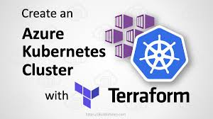

# Terraform - Azure Kubernetes Service

 

## Introduction

This Terraform project create two Kubernetes cluster and container registry.

Then you can run the Weight Tracker app on the Kubernetes cluster using the Azure Devops pipeline

# Running instructions
* Connect your machine to Azure using `az login`
* Make sure you are at `setup` directory
* Run: `terraform init`
* Run: `terraform plan`
* Run: `terraform apply`