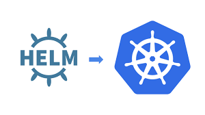

# K8s deploy with Helm

Deployment using k8s and Helm.

`azure-pipelines-1.yml` is pipeline that following those steps:

#### CI

* Build and push image to Azure Container Registry
* Install Helm on agent.
* Package `charts` directory.

Yaml files to create resources is stored at `charts` directory.

#### CD

* Install Helm on the pods.
* Helm deploy using `upgrade` command with `postgresql-chart`.
* Login to the cluster.
* Export postgresql database password and insert as run time variable.
* Create secret file.
* Helm deploy using `upgrade` command with `weight-app` chart we created at the CI.
